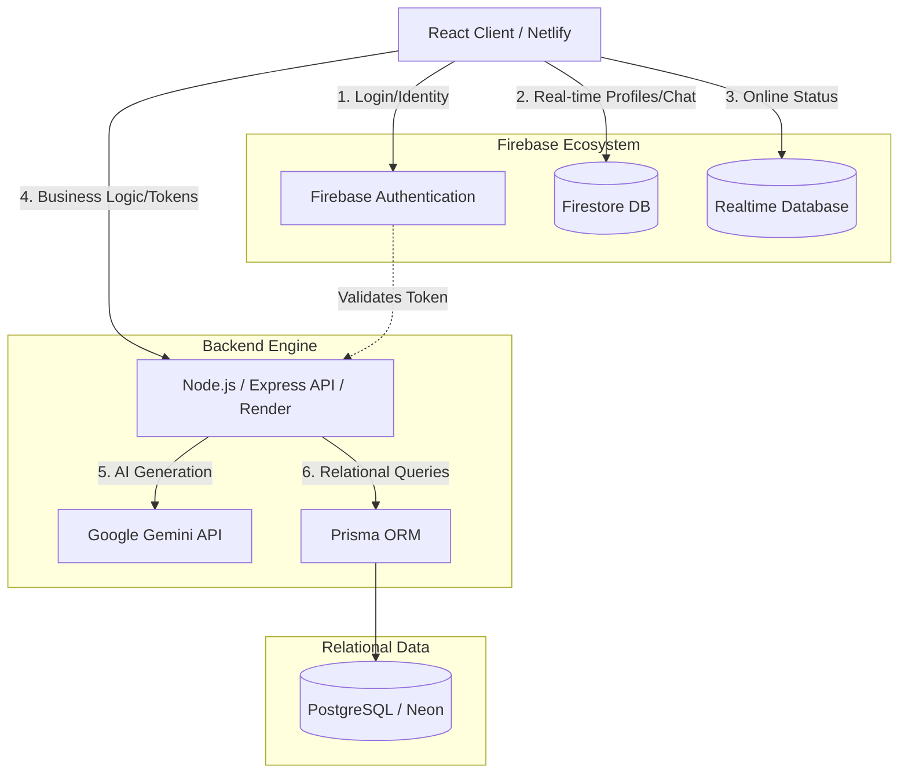
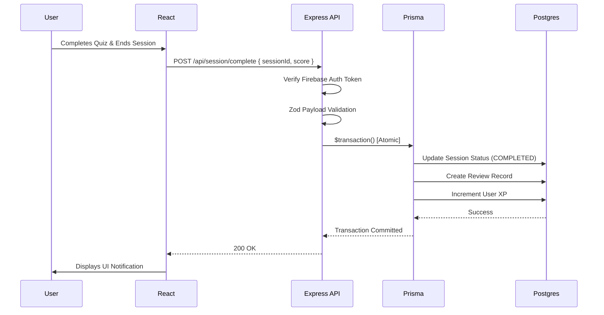

# SkillSwap - High Level Design (HLD)

## 1. System Architecture Overview

SkillSwap uses a modern decoupled architecture, combining the speed of Firebase's NoSQL ecosystem with the reliability of a PostgreSQL relational database. 

The system relies on the following major components:
- **Client (Frontend):** React (Vite), React Router, deployed on Netlify as a Single Page Application (SPA).
- **Backend API:** Node.js/Express REST API, deployed on Render.
- **Authentication:** Firebase Auth.
- **NoSQL / Real-time Layer:** Cloud Firestore (User profiles, chat) and Realtime Database (Presence).
- **Relational Database:** PostgreSQL (Neon Serverless) managed via Prisma ORM (Swap requests, sessions, XP).
- **AI Engine:** Google Gemini (Generates roadmaps, quizzes, insights).

### Why both Firebase and PostgreSQL?
SkillSwap uses **Firebase (Firestore/RTDB)** for features that require instant, real-time client synchronization without overloading an API server (e.g., active user presence, live chat messages, and immediate profile updates).

It uses **PostgreSQL** for structured, relational workflows where ACID compliance and atomic transactions are critical (e.g., sending a swap request, linking users into a session, and awarding XP safely). 

## 2. System Architecture Diagram

## 3. Major Data Flows

### A. Authentication & Real-time Flow
1. User logs in on the client via **Firebase Auth**.
2. The client subscribes to **Firestore** (`/users/{uid}`) for profile updates.
3. The client connects to **Realtime Database** (`/status/{uid}`) to broadcast online presence and handles disconnects.

### B. Relational Business Logic (e.g. Completing a Session)

### C. Security and AI Flow
1. Client sends a request to the backend (e.g., "Generate Quiz").
2. Backend API applies **Express Rate Limiting** to prevent abuse.
3. Backend validates the prompt via **Zod**.
4. The input is sanitized using `sanitize-html`.
5. The prompt is wrapped in a **Prompt Injection Protection** boundary.
6. The request is sent to the **Gemini API**.
7. The response is parsed, and token usage is logged on the backend.
8. The safe structured output is returned to the client.
